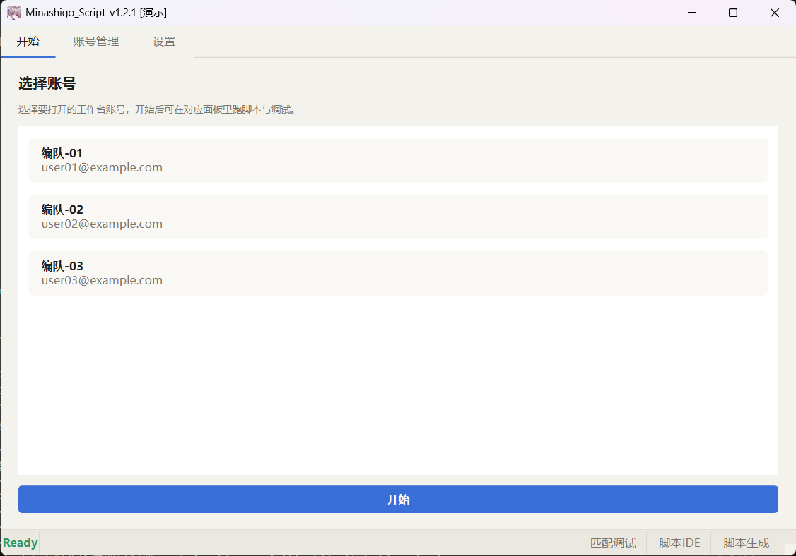
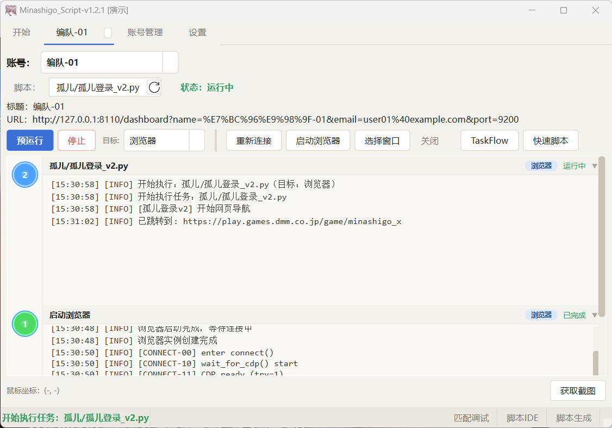

# Minashigo Script

基于图像识别的页游 / 桌面自动化框架，支持浏览器与原生窗口双模式控制。内置 AI Script Generator，可根据自然语言描述生成 Python 自动化脚本。

[](https://github.com/heimordinger/Minashigo_Script)


## 界面预览

主界面（演示模式账号列表）：



账号工作台（浏览器目标 + 脚本运行日志）：



## 功能

- **AI 脚本生成**：配置 LLM API，结合文字描述与截图，生成可执行的 Python 脚本
- **双模式控制**：浏览器自动化（Playwright）或桌面窗口控制（Win32）
- **图像匹配**：OpenCV 多尺度模板匹配、多实例匹配、可选颜色校验；热点 ROI 收缩搜索区
- **FSM 脚本引擎**：有限状态机 + 全局守卫，长流程按状态拆分，弹窗统一处理
- **伪录制复盘**：运行过程写入时间线与关键帧，`summary` 输出耗时分类及黑屏 / 有效耗时
- **TaskFlow**：可视化节点编排，无需手写代码即可串联流程
- **看门狗**：长时间无进展自动终止，避免脚本卡死
- **多账号**：多账号独立配置与独立浏览器实例

## 快速开始

### 下载 Releases（推荐）

从 [Releases](https://github.com/heimordinger/Minashigo_Script/releases) 下载最新 zip，解压后运行 `Minashigo_Script.exe`。

### 源码运行

```bash
pip install -r requirements.txt
playwright install chromium
python main.py
```

## 使用

### 账号与任务

1. 在「账号管理」添加账号
2. 在「开始」页选择账号并启动
3. **浏览器模式**：启动 Chromium 后选择脚本执行
4. **窗口模式**：「选择窗口」绑定目标 HWND 后执行脚本

### TaskFlow

1. 在账号界面打开 TaskFlow
2. 拖拽节点编排流程（点击、匹配、条件、循环等）

### Script Generator

1. 进入「脚本生成」，配置 AI 提供商与 API Key
2. 编写或加载脚本描述（`.txt`），可选上传参考截图
3. 生成脚本并保存到 `scripts/`

### 调试与复盘

- 异常结束时可查看 `screenshots/daily_stop/` 归档帧
- 开启伪录制后，会话输出在 `screenshots/pseudo_record/`（`timeline.jsonl`、`summary.txt`、`frames/`）
- 匹配调试窗口可查看模板命中位置与分数

### 演示模式（截图 / 展示）

不加载真实 `json/accounts.json`，使用示例账号（`编队-01` 等），浏览器配置写入 `browser_data_demo/`，日志邮箱自动打码。

```bash
# Windows
tools\run_demo.bat

# 或手动
set MINASHIGO_DEMO=1
python main.py
```

示例账号定义见 `core/demo_mode.py` 与 `json/accounts.demo.json`。

## 项目结构

```
Minashigo_Script/
├── main.py                     # 入口
├── core/                       # 启动、路径、配置、TaskFlow API
├── controller/                 # 主控与任务调度
├── gui/                        # PySide6 界面
├── backend/
│   ├── browser/                # Playwright、游戏区截帧
│   ├── automation/             # 窗口控制、帧观察、伪录制、卡死守卫
│   ├── matcher/                # 图像匹配、热点 ROI
│   └── script_generator/       # AI 生成、语料、修订
├── taskflow/                   # 可视化工作流
├── script_spec/                # 脚本说明编辑器
├── scripts/                    # 业务脚本（Deep One / 孤儿等）
├── assets/                     # 模板图片等资源
└── models/                     # OCR 等模型（运行时下载）
```

## 脚本示例

| 脚本 | 说明 |
|------|------|
| `scripts/Deep One/DO登录_v2.py` | 网页导航、DMM 登录、游戏内 FSM 登录 |
| `scripts/Deep One/DO日常_v1.py` | 日常任务（礼物、任务奖励、JJC、塔等） |
| `scripts/Deep One/DO推本_v2.py` | 推本流程 |

脚本目录下每个游戏通常配有 `assets/images/` 中对应的模板图与说明文件。

## 技术栈

| 类别 | 技术 |
|------|------|
| GUI | PySide6 |
| 浏览器 | Playwright |
| 桌面 | Win32 (ctypes) |
| 视觉 | OpenCV |
| AI | LangGraph / LangChain Core |
| OCR | Tesseract |
| 凭据 | keyring |

## 说明

- 个人学习与自动化实践项目，请遵守目标网站服务条款及当地法律
- 账号、Cookie、`browser_data/`、本地截图等运行时数据默认不提交到仓库

## 许可证

[LICENSE](LICENSE)
